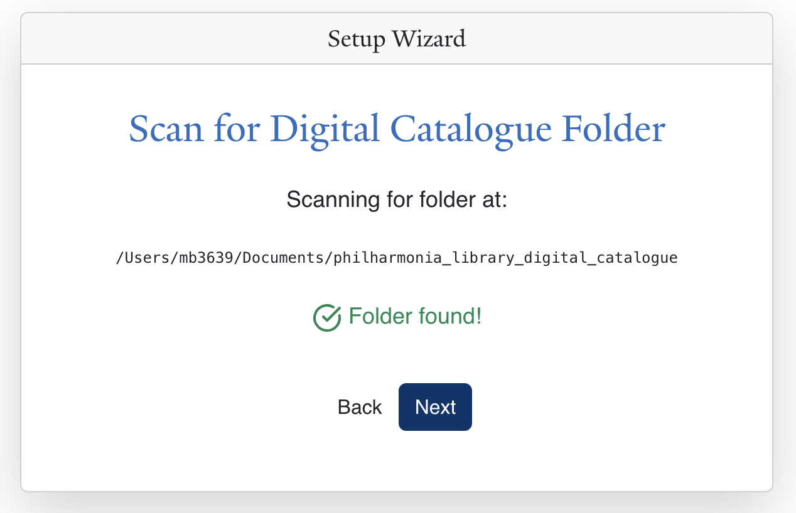
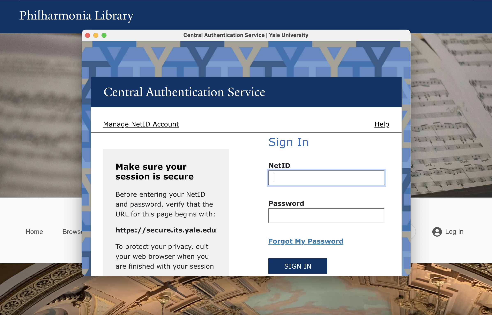

# Yale Philharmonia Library Catalogue Application

A desktop application developed specifically for and used internally by the Yale School of Music for cataloguing, reporting, and managing the Yale Philharmonia Library collection.

A demo build is available for outside review.

This project replaces a slow, spreadsheet-based workflow with a fast, centralized system for tracking, searching, and organizing scores and parts.

Built with [Electron](https://www.electronjs.org/), [React](https://reactjs.org/), and [Node/Express](https://expressjs.com/) as a portfolio project to demonstrate full-stack desktop app development.

---

## Features

- **Catalogue and Manage Library Holdings**  
  - Add new scores or parts with automatically-generated call numbers
  - Thorough metadata records (condition, public domain, missing parts, etc.)
  - Edit or delete existing holdings  
  - Automatic record validation

- **Browse & Search**  
  - Filter (basic or advanced) by composer, title, publisher, and/or genre
  - Quick navigation between works and their Digital Catalogue counterparts

- **Digital Catalogue Management**  
  - View and organize scanned PDFs or born-digital materials  
  - Upload, preview, and open files locally

- **Generate Reports**  
  - Automatically generate and export custom reports (by composer, condition, missing part status, etc.)  
  - Summarize holdings for inventory or programming purposes

- **Data Backups**
  - Export holdings data as a CSV file to preserve data/transfer to another system
  - Automatically compress and export the digital catalogue

- **Admin Management**  
  - User authentication handled via Yale University's Central Authentication System (CAS), with additional RBAC logic for app-specific permissions
  - Admins can add/remove other admins and manage library settings/holdings

---

## Classification Guide

This application is designed to implement the **Dickinson Classification Scheme for Musical Compositions**, a system widely adopted by music libraries, including those at Vassar College and Columbia University. An overview and examples can be found here: https://www.jstor.org/stable/23505207

---

## Tech Stack

- **Frontend:** React/Redux, React Bootstrap, custom CSS  
- **Backend:** Node.js, Express  
- **Database:** SQLite (demo) / MySQL (internal)
- **Cloud:** Internal database hosted on Google Cloud Platform VM
- **Desktop shell:** Electron  
- **Authentication:** Yale CAS, jsonwebtoken

## Development Notes

Built as a real-world tool adopted and currently used by the Yale School of Music to improve workflow, this application also showcases:

- Cross-platform desktop development
- Secure authentication and role management 
- CRUD interfaces and data validation
- Clean code structure and component-based UI with modern state management tools (Redux, Electron store)
- Security Features
  - Parameterized queries to prevent SQL injection
  - Secure storage of credentials and environment variables
  - XSS sanitization middleware for user input
  - Authentication and role-checking middleware to protect admin-only routes

---

## Why This App

The library’s spreadsheet system was slow, hard to scale, and scattered across multiple procedures.  
This project centralizes cataloguing, searching, reporting, and administration in one intuitive app — saving staff time and reducing errors.

---

## Features Visualized

Setup Wizard step to set digital catalogue folder



Secure authentication with Yale Central Authentication System (CAS)



## Getting Started

### Option 1: Download the Demo

1. Download the packaged build (`Philharmonia Library Catalogue-demo.exe`).  
2. Double-click to run — demo data is preloaded.

*Note: As of December 2025, there are some issues opening the Demo Mac Build because of Apple signing and notarization restrictions. To review this project in demo mode, please see Option 2.*

### Option 2: Run the Demo from Source (Recommended For Developers)

#### Prerequisites

- Node.js v18 or higher
- npm v9 or higher

This project is designed to run in **demo** mode for local development.

*Internal mode requires protected assets and environment variables that are not included in this repository, so modifying renderer flags or attempting to run in internal mode will break the build.*

1. Clone the repository.  
   ```bash
   git clone https://github.com/mbasagoitia/yale-library-project.git
2. Navigate to the repo:
   ```bash
   cd yale-library-project
3. Install dependencies:
   ```bash
   npm install
4. Configure environment variables:
    ```bash
    npm run prepare-env
  
  Or, manually copy .env.development.demo.example → .env.development.demo. No secrets (database credentials, keys, etc.) are included, as all demo data is bundled locally.

5. Start in development mode:
    ```bash
    npm run start:demo

This runs:

- React development server
- Express backend server
- Electron app in demo mode

### Option 3: Build and Run Locally

If you prefer a faster, production-level experience, build the demo locally:

1. Follow steps 1-4 above
2. `npm run build:demo`
3. Navigate to `dist/demo' and open `Yale Philharmonia Library Catalogue-demo-0.1.1-arm64.dmg` (or similar file)

*Note: The project was developed on macOS. Running in development mode should work on Linux and Windows, but some OS-specific adjustments may be required (e.g., native dependencies or file paths). For full demo experience, macOS is recommended.*

## Installation Notes

### macOS (Signed & Notarized)

- The macOS version of this app is signed with my Apple Developer ID and notarized by Apple.
- This means you can open the .dmg or .app file directly without needing to bypass security warnings.
- If you still see a Gatekeeper prompt (rare), right-click the app → select Open → confirm once. After that, macOS will remember your choice.

### Windows (Unsigned)

- The Windows version is currently unsigned. This means Windows SmartScreen may show a warning when you try to run the .exe installer.

To proceed:

- Click More info.
- Then click Run anyway.
- The app does not contain malware — the warning only appears because the installer is unsigned.

#### Future Plans

I plan to obtain a Windows code-signing certificate in the future. Once signed, the Windows installer will no longer trigger SmartScreen warnings.

## Demo vs Internal Builds

This project has two versions:

- **Demo Build:** Safe for public review, uses sample data, and contains no sensitive keys.  
- **Internal Build:** Configured with private environment variables and deployed only within the Yale School of Music.

The source code runs in demo mode by default. To protect library data, the internal version requires a protected configuration and is not publicly distributed.

### Database

The **demo database** contains a small subset of the Yale Philharmonia's publicly-available catalogue holdings, along with public-domain PDF files sourced from the International Music Score Library Project (IMSLP) for demonstration purposes only. The demo SQLite database is built and bundled locally.

The **internal database** is hosted on MySQL in a virtual machine on Google Cloud Platform and requires configuration and authentication available only to users of the internal build. The database is hosted remotely to allow connections from multiple clients in the Yale School of Music.

### Fonts & Assets

#### Fonts

Licensed Yale typeface and other proprietary assets are included only in the internal build, in accordance with Yale University’s licensing agreements.

The public demo build uses open-source or system-default typefaces to ensure that no protected intellectual property is distributed.

#### Images

- All original images are used with permission from the Yale media and communications department
- Decorative images are sourced from <a href="https://unsplash.com/">Unsplash</a>, an open-source image repository.

- Desktop icon: <a href="https://www.flaticon.com/free-icons/music-book" title="music book icons">Music book icons created by Freepik - Flaticon</a>

## License

This project is licensed under the MIT License — see the LICENSE file for details.

## Future Additions and Improvements

- Bulk import of library records
- Advanced batch editing tools
- Improved reporting filters and templates
- Add optional cloud integration for digital catalogue (BackBlaze or similar)
- Add metadata for advanced filtering in digital catalogue